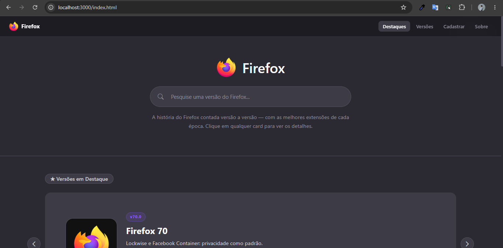
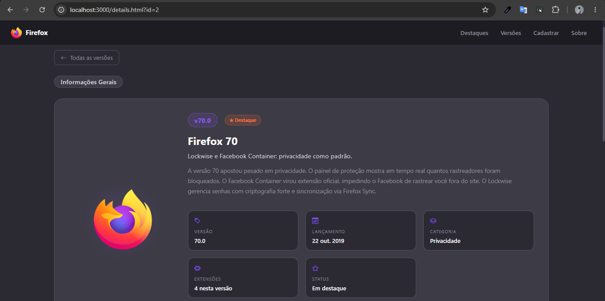

# Firefox — Versões & Extensões

**Aluno:** Arthur Gabriel  
**Matrícula:** 924860  
**Curso:** Engenharia de Software — 1º Período — Turma Manhã

---

## Como rodar o projeto

### 1. Instalar dependências (só na primeira vez)

```bash
npm install -g json-server
```

### 2. Iniciar o JSON Server

Na pasta raiz do projeto:

```bash
json-server --watch db/db.json --port 3000 --static public
```

### 3. Abrir no navegador

```
http://localhost:3000
```

---

## Estrutura do projeto

```
/
├── public/                  ← Front-end servido pelo JSON Server
│   ├── index.html           ← Home com carousel e cards
│   ├── script.js            ← Lógica da home (fetch + render)
│   ├── details.html         ← Página de detalhes de uma versão
│   ├── details.js           ← Lógica de detalhes (URLSearchParams + fetch)
│   ├── cadastro_versao.html ← Formulário de cadastro
│   ├── cadastro_versao.js   ← Lógica do cadastro (POST via fetch)
│   ├── style.css            ← Estilos visuais
│   └── img/                 ← Imagens dos logos
│       ├── 2013.png
│       ├── 2019.png
│       ├── 2021.png
│       └── mozilla.png
└── db/
    └── db.json              ← Banco de dados da API REST
```

---

## Estrutura do db.json

### Coleções

| Coleção | O que guarda |
|---|---|
| `versoes` | Cada versão do Firefox com nome, descrição, imagem, categoria, tags e extensões associadas |
| `categorias` | Lista das categorias possíveis com nome, descrição e cor |
| `comentarios` | Comentários de usuários vinculados a uma versão por `versaoId` |
| `avaliacoes` | Nota (1-5) de cada versão vinculada por `versaoId` |

### Modelo de um item da coleção `versoes`

```json
{
  "id": 1,
  "nome": "Firefox 57 — Quantum",
  "versao": "57.0",
  "descricaoCurta": "Motor Quantum: 2x mais rápido e 30% menos memória que o Chrome.",
  "descricaoCompleta": "Texto detalhado...",
  "imagem": "img/2013.png",
  "categoria": "Performance",
  "lancamento": "2017-11-14",
  "destaque": true,
  "cor": "#ff7139",
  "tags": ["quantum", "rust", "performance"],
  "extensoes": [
    {
      "nome": "uBlock Origin",
      "icone": "bi-shield-fill-check",
      "cor": "#e44d26",
      "descricao": "Bloqueador de anúncios leve e open-source."
    }
  ]
}
```

---

## Rotas da API disponíveis

| Método | Rota | Descrição |
|---|---|---|
| GET | `/versoes` | Lista todas as versões |
| GET | `/versoes/:id` | Busca uma versão pelo ID |
| POST | `/versoes` | Cadastra uma nova versão |
| GET | `/categorias` | Lista todas as categorias |
| GET | `/comentarios?versaoId=:id` | Busca comentários de uma versão |
| GET | `/avaliacoes?versaoId=:id` | Busca avaliação de uma versão |

---

## Imagem da Home



## Imagem da página de detalhes

